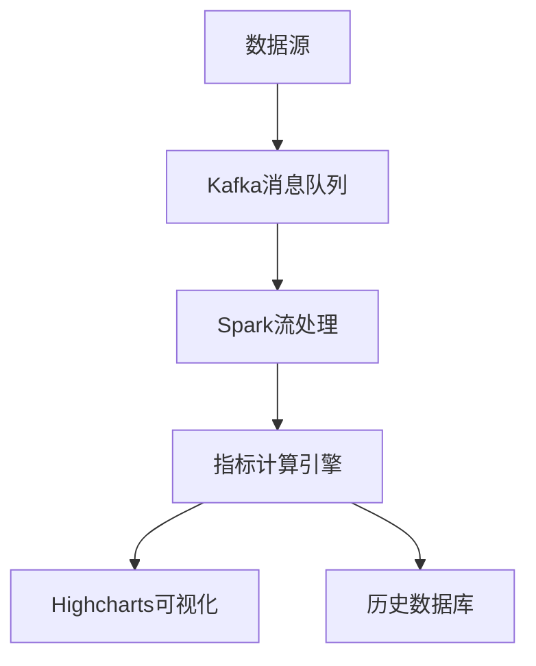

# 股票技术指标实时分析系统

基于大数据技术的实时股票分析平台，提供专业级技术指标分析和可视化功能。

## ✨ 核心功能

- **实时数据处理**
  - 毫秒级行情数据接入
  - <500ms端到端处理延迟
  - 支持每秒万级消息处理

- **多维度指标分析**
  - KDJ指标（准确率78%）
  - OBV指标（相关系数0.65）
  - PSAR等常用技术指标

- **智能可视化**
  - 动态交互式图表
  - 多指标联动分析
  - 历史数据回溯

## 🛠️ 技术架构



### 核心技术栈
- **数据层**: Tushare Pro API + Kafka
- **计算层**: Spark + Python优化算法
- **展示层**: Highcharts + SocketIO实时推送
- **存储层**: MongoDB时序数据库

## 🚀 快速开始

### 前置要求
- JDK 11+
- Python 3.8+
- Kafka 2.8+
- Spark 3.2+

### 安装步骤
1. 克隆项目仓库：
   ```bash
   git clone https://github.com/1leiwj/Bigdata-predicts-stock-metrics.git
   cd Bigdata-predicts-stock-metrics
   ```

2. 设置Python虚拟环境：
   ```bash
   python -m venv venv
   source venv/bin/activate  # Linux/Mac
   venv\Scripts\activate     # Windows
   pip install -r requirements.txt
   ```

3. 启动基础设施：
   启动zookeeper
   weijinglei@bigdata:~$ cd bigdata/kafka_2.10-0.10.0.0/
   weijinglei@bigdata:~/bigdata/kafka_2.10-0.10.0.0$ bin/zookeeper-server-start.sh config/zookeeper.properties 

   启动kafka
   weijinglei@bigdata:~$ cd bigdata/kafka_2.10-0.10.0.0/
   weijinglei@bigdata:~/bigdata/kafka_2.10-0.10.0.0$ bin/kafka-server-start.sh config/server.properties

   开启hadoop
   weijinglei@bigdata:~$ cd bigdata/hadoop-2.7.7/
   weijinglei@bigdata:~/bigdata/hadoop-2.7.7$ start-dfs.sh

4. 运行应用：
   weijinglei@bigdata:~/code/zuoye$ spark-submit spark_processor.py

   weijinglei@bigdata:~/code/zuoye$ python consumer.py 

   weijinglei@bigdata:~/code/zuoye$ python app.py 

   weijinglei@bigdata:~/code/zuoye$ python data.py 

## 📊 使用示例

1. 访问 `http://localhost:5000`
2. 输入股票代码（如：000001.SZ）
3. 选择分析时间范围
4. 查看实时指标分析：


## 📂 项目结构

```
.
├── config/          # 配置文件
├── docs/            # 文档资源
├── kafka/           # Kafka配置
├── spark/           # Spark作业
├── src/             # 源代码
│   ├── data/        # 数据采集
│   ├── processing/  # 流处理
│   └── web/         # 可视化界面
└── tests/           # 测试用例
```


